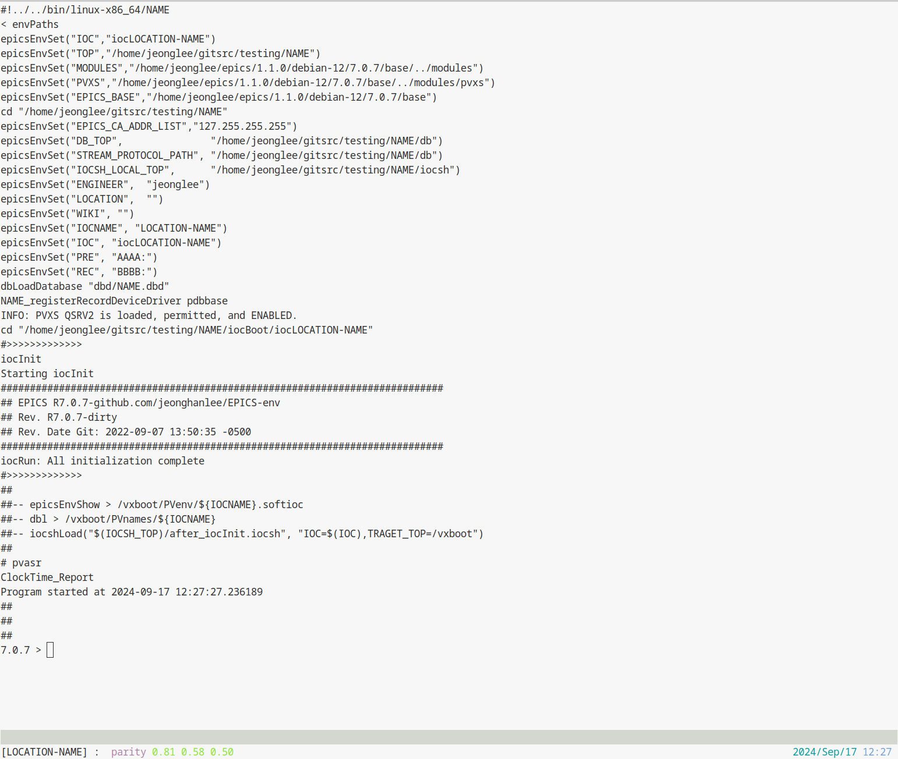

# tools

[](https://git.als.lbl.gov/alsu/tools/-/commits/master) 

## Requirements

* For setup : git, tree, bash, and EPICS BASE
* For IOC running : screen

## `generate_ioc_structure.bash`

This script is developed to reduce the manual workflow in EPICS IOC Development Guide (AL-1451-7926). The script must be called in a directory where the script is located. It can be outside of the cloned path or a new folder within the cloned path.

There are two mandatory options, such as **Device Name (APPNAME)** and **LOCATION**. Two options should be defined according to the IOC Name Naming Convention documents [1].
However, it is recommended to use the third options **-c**, because this option allows users to setup a relevant git configuation and the ALS gitlab CI on a created folder.
In addtion, it uses the ALS site-specific EPICS `makeBaseApp` template to prepare many common environment within the folder by default. If one don't want to use the ALS site-specific template, please use `-t` option to build a folder/file structure based on the EPICS standard template.

## Command Examples

### EPICS IOC, git, gitlab CI, and ALS Site Specific Configuration

```bash
bash tools/generate_ioc_structure.bash -p APPNAME -l LOCATION -c
```

### EPICS IOC and EPICS Standard Configuration

```bash
bash tools/generate_ioc_structure.bash -p APPNAME -l LOCATION
```

### EPICS IOC, git, gitlab CI, and EPICS Standard Configuration

```bash
bash tools/generate_ioc_structure.bash -p APPNAME -l LOCATION -t
```

### Add git and gitlab CI into an exsiting repository

* `git init` if there is no `.git` path
* add `epics_ci`, please see https://github.com/epics-base/ci-scripts
* add `.gitignore` if there is no `.gitignore`.
* add `.gitattributes if there is no `.gitattributes`.

```bash
git clone ssh://existing_repository
cd existing_repository
bash where_your_path//tools/generate_ioc_structure.bash -c -a
```

## Test Example

One can test the basic configuration via the following commands. Note that one can see many error messages, because the default configuration should be define in the same way how ALS does.
However, at least one can get glimpse how it works from scratch.

```bash
git clone ssh://git....../tools tools
cd tools
mkdir -p testing
cd testing
bash ../generate_ioc_structure.bash -p NAME -l LOCATION -c
cd NAME/iocBoot/iocLOCATION-NAME/
make -C ../../
./run
[detach ctrl+a d]
./attach
exit
```

||
| :---: |
|**Figure 1** EPICS IOC within the customized screen window.|


## References

[1] AL-1451-7452 : IOC Name Naminng Conventions at ALS and its dynamic google sheet in https://docs.google.com/spreadsheets/d/1eYWBc4j8olio_nBOZWEfnwiU5Xaf5ZfzLvmnif3JzwY/edit?usp=sharing
